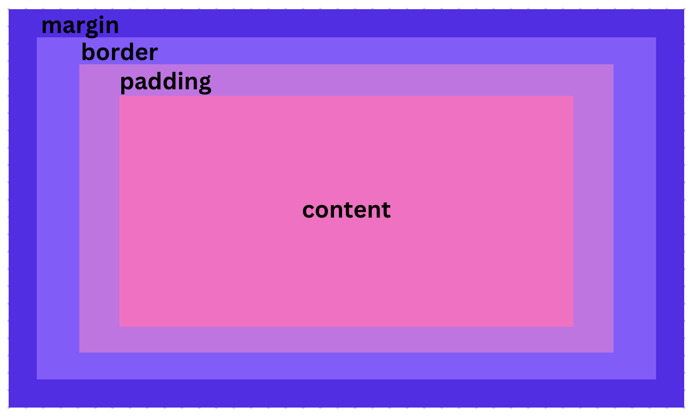

## Rich Web Lab 4 - Exercise Question**

 1. **Explain using code examples what is meant by props and state in React JS?**

    **Props:** In React, data is passed from a parent component to a child component using properties, known as props. Because props are immutable, a child component cannot change the props it inherited. They are inherited by the components from their parents.

	**Parent Component**

	```js import React from 'react';

	import ChildComponent from 

	const ParentComponent = () => {
		
		const data = 'passing data';

		return (

			<div>

				<ChildComponent message={data} />

			</div>

		);

	};
	```

	**Child Component**

	```js 
	import React from 'react';

	const ChildComponent = (props) => {

		return (

			<div> 
				<p>{props.message}</p>
			</div>

		);

	};

	export default ChildComponent;
	 ```

	**State:** A component's internal state is managed and represented using state. The difference from it from props is that the component itself can modify the state. A component's re-render is triggered by state changes, enabling dynamic UI modifications.

	```js
	import React, { useState } from 'react';

	const counter = () => {

		const [count, setCount] = useState(0);

			const increment = () => {

			setCount(count + 1);

		};

		return (

			<div>

				<p>Click the button to increment the number</p>

				<p>Counter: {count}</p>

				<button onClick={increment}>Click me</button>

			</div>

		);

	};

	export default counter;
	```

2. **In functional programming, what does the term functor mean? Can you give an example in JavaScript?**

	A functor is an object that implements a map function. It is useful for applying functions to values inside it while maintaining the functor's structure. A way to generalize and abstract the concept of mapping over elements in a container is to use functors.

	``` JS
	// Array Functor

	const numbers = [1, 2, 3, 4, 5];

	// Define function to double a number

	const double = (x) => x * 2;

	//Map function to create a new array with doubled values

	const doubledNumbers = numbers.map(double);

	console.log(doubledNumbers); // Output: [2, 4, 6, 8, 10]
	```

3. **We have looked at three kinds of asynchronous programming mechanisms, namely callbacks, promises and streams. Mention one advantage and one disadvantage of each type.**

	**Callbacks**

	

 - Advantage - Callbacks are an effective simple mechanism. They can be
   utilized in situations that might not support promises or async/await
   syntax because they are simple to understand.
   
 - Disadvantages - The code structure can become complicated and
   difficult to read when handling several asynchronous operations or
   nested callbacks. This is referred to as "Callback Hell".

	**Promises**

 - Advantage - Promises enable method chaining, which makes asynchronous programming clearer and easier to read. They provide an organized mechanism for handling mistakes by using the .catch method.

 - Disadvantage - Promises lack built-in cancellation mechanisms. A promise cannot simply be cancelled once it has been initiated; it will either resolve or be rejected.

	**Streams**

 - Advantage - When working with huge datasets, streams are useful because they enable data to be processed in memory-saving chunks.

 - Disadvantages - Compared to callbacks or promises, streams can be more complicated to implement and work with. A longer learning curve may be necessary for understanding concepts like backpressure and handling reading and writable streams.

 4. **With the aid of a diagram and example code, describe the Cascading Style Sheets (CSS) Box****
	**Model and show how it can be used to space DOM elements.**

	A fundamental concept that handles how elements are arranged on a web page is the CSS Box Model. Each element has margin spaces, padding, borders, and content surrounding it.
	**Content:** The element's actual content, which may be text, pictures, or other types of media.
   **Padding:** Makes space for the information. It has no background colour
   and is transparent. Within the border is the padding.
   **Border:** surrounding the padding. It could be a certain width, colour,
   or style.
   **Margin:** Removes stuff outside the boundary. It has no background
   colour and is transparent. The distance between elements is called
   the margin.

	In styles.css – we can have

	``` CSS 
	.box {

		width: 200px;

		height: 100px;

		padding: 20px;

		border: 2px solid #333;

		margin: 20px;

	}
	```
	And in the index.html – we can have
	```html
	<div class="box">

		<p>Content</p>

	</div>
	```

	The Diagram:
	
	The div element in this example has the class "box." The "box" class has the following CSS styles applied. Width, height, padding, border, and margin. You can change these for the spacing. The entire amount of space an element takes up on the page is determined by its padding, border, margin, and content combined.
    
    
 5.  **Detail how the browser loads and bootstraps a rich web application from an initial URL.**
 - User Request: User enters a URL or clicks a link. 
 - Server Interaction: Browser sends an HTTP request to the server.
 -  Resource Loading: Server sends back HTML, CSS, and JavaScript. 
 - Parsing and Rendering: Browser parses HTML, constructs DOM, and renders initial view. 
 - JavaScript Execution: JavaScript is executed, enhancing functionality. Dynamic
 - Loading: Additional resources, like data or scripts, are loaded
   dynamically. 
  - Application Bootstrapping: JavaScript initializes the
   application, sets up state, and prepares for interaction. 
   - User Interaction: Fully loaded and initialized web app allows user
   engagement.
